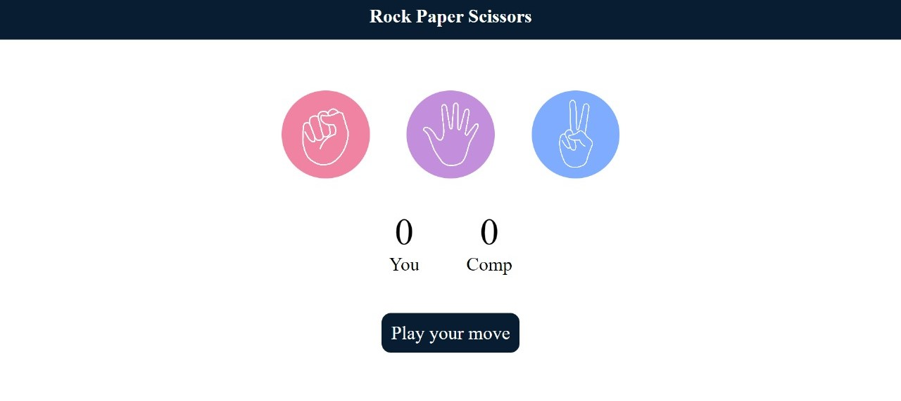
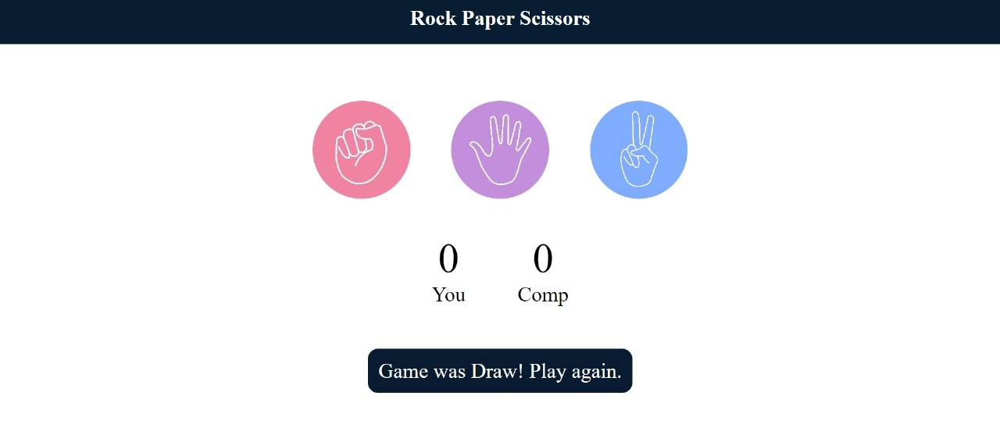
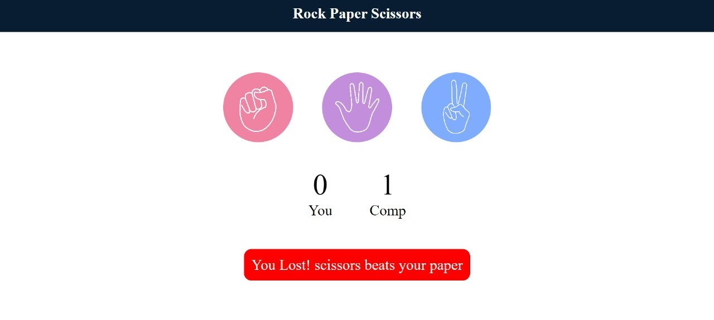
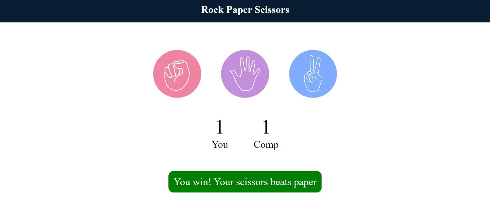

# Rock-Paper-Scissors-Game

Rock Paper Scissors is a common game usually played in real. But this is a touch of technology to be integrated into its tech version to be played unlimited time , without need to be reminded of counting the scores which is often hectic. This game make it easy hassle-free to count the points and making the clear winner.

On the first fo the poinsta are assigned to 0, as starting of the game it calculates the point on its own hassel-free and easier.

It has a feature of showing clear property , whether its a winner or a looser , further more if its draw/tie, between the user and the computer.

The game is made using lamguages : HTML, CSS, JavaScript code.

